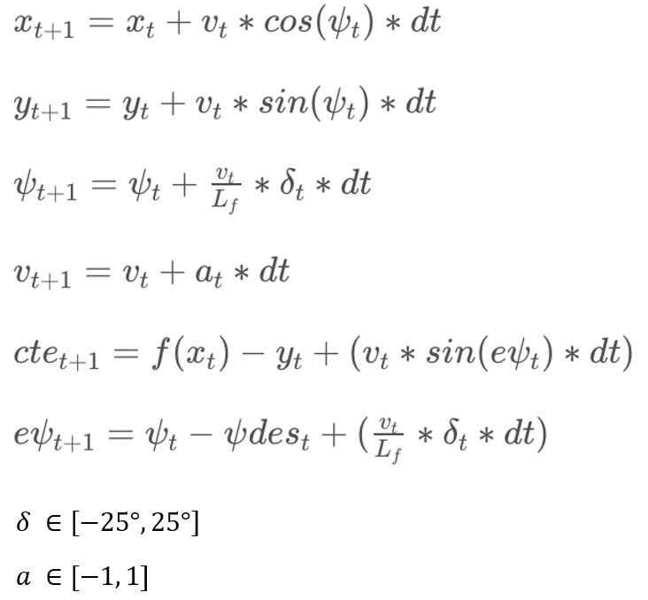

# CarND-Controls-MPC
Self-Driving Car Engineer Nanodegree Program

---

## Purpose

The purpose of the project is to implement Model Predictive Control to drive the car around the track in the simulator.
There is a 100 millisecond latency between actuations commands on top of the connection latency.

## Implementation

The following is the final output video.
[Final Video](./Output_video.mp4)

The followings are discussion points.
* **The Model**

 A kinematic model is used. The state vector includes the vehicle's x and y coordinates(x, y), orientation angle (psi), velocity(v), cross-track error(cte) and psi error (epsi). Actuators are acceleration(a) and steering angle(delta).
The followings are update equations and constraints on actuation variables.


* **Timestep Length and Elapsed Duration (N & dt)**

Here I set the dt to be 0.1s, the same as the latency between actuations commands on top of the connection latency. Because the other latancy such as connetction and computing latency are negligible, I can simply consider the ideal actuation in the previous step as the true actuation in the current step. After several trials, I choose the N to be 10. The combination of the chosen N(20) and dt(0.1) works well on predict a practicable trajectory.
Other values of N & dt I tried is 5 & 0.1, 10 & 0.1, 15 & 0.1, 20 & 0.1, 25 & 0.1.

* **Polynomial Fitting and MPC Preprocessing**

I transform thoes waypoints from the map coordinate systems to the vehicle coordinate systems. These makes it easy to pass values to  plot trajectories, and reduce the amount of calculation in the following process as well.
Then I fit these new waypoints to a third degree polynomial.

* **Model Predictive Control with Latency**

the cost function includes cte, epsi, difference between velocity and the reference velocity, delta, acceleration, the value gap between sequential actuations(a and delta). the IPOPT and CPPAD libraries are used to minimize cost and calculate an optimal trajectory and actuations within a timestep.
To deal with latency, since I already set dt to be the same as the latency, when using model update equations, I use the the actuation values in the previous step to be the actuation inputs in the current step.

## Dependencies

* cmake >= 3.5
 * All OSes: [click here for installation instructions](https://cmake.org/install/)
* make >= 4.1(mac, linux), 3.81(Windows)
  * Linux: make is installed by default on most Linux distros
  * Mac: [install Xcode command line tools to get make](https://developer.apple.com/xcode/features/)
  * Windows: [Click here for installation instructions](http://gnuwin32.sourceforge.net/packages/make.htm)
* gcc/g++ >= 5.4
  * Linux: gcc / g++ is installed by default on most Linux distros
  * Mac: same deal as make - [install Xcode command line tools]((https://developer.apple.com/xcode/features/)
  * Windows: recommend using [MinGW](http://www.mingw.org/)
* [uWebSockets](https://github.com/uWebSockets/uWebSockets)
  * Run either `install-mac.sh` or `install-ubuntu.sh`.
  * If you install from source, checkout to commit `e94b6e1`, i.e.
    ```
    git clone https://github.com/uWebSockets/uWebSockets
    cd uWebSockets
    git checkout e94b6e1
    ```
    Some function signatures have changed in v0.14.x. See [this PR](https://github.com/udacity/CarND-MPC-Project/pull/3) for more details.

* **Ipopt and CppAD:** Please refer to [this document](https://github.com/udacity/CarND-MPC-Project/blob/master/install_Ipopt_CppAD.md) for installation instructions.
* [Eigen](http://eigen.tuxfamily.org/index.php?title=Main_Page). This is already part of the repo so you shouldn't have to worry about it.
* Simulator. You can download these from the [releases tab](https://github.com/udacity/self-driving-car-sim/releases).
* Not a dependency but read the [DATA.md](./DATA.md) for a description of the data sent back from the simulator.


## Basic Build Instructions

1. Clone this repo.
2. Make a build directory: `mkdir build && cd build`
3. Compile: `cmake .. && make`
4. Run it: `./mpc`.
